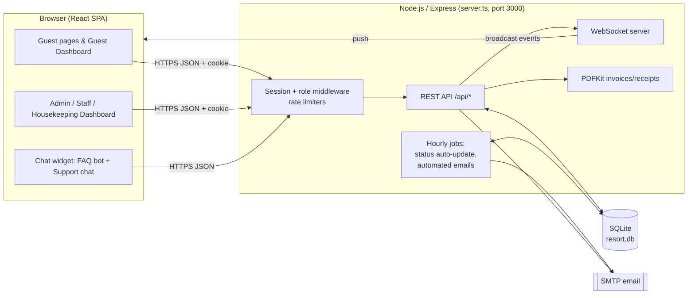
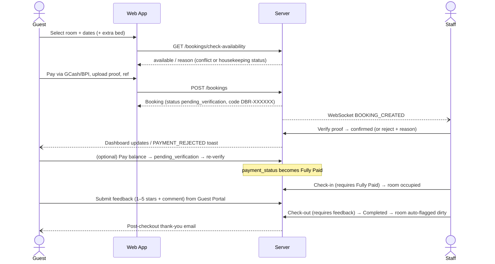
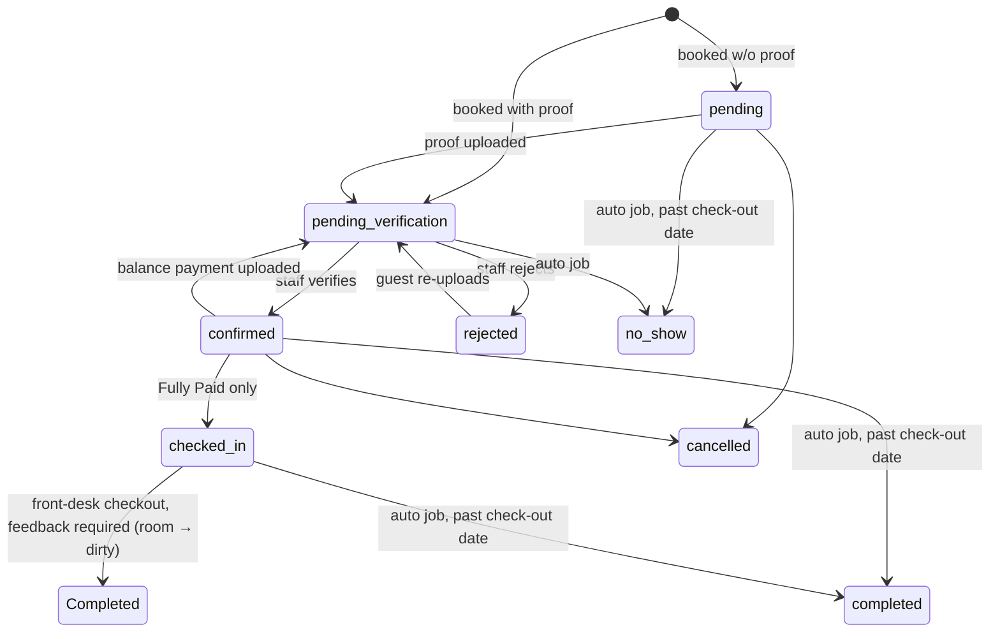
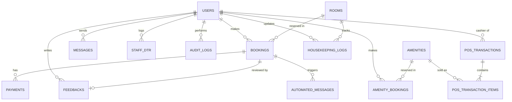

# Da Bali Resort Management System: System Overview & Handoff

> **Snapshot date:** September 29, 2026 · **Branch:** `main` · **Latest commit:** `d6f64b7 Update: room/amenities photos`
> **Changes since the previous snapshot (Sep 25, `61cbbbb`):** About Us section (story, vision, mission) · self-service staff time clock · auto-generated staff credentials + admin password reset · guest feedback now *required* before front-desk checkout · real room/amenity photos loaded from folders · support-chat message deletion removed · several access-control fixes (DTR endpoints, safe user deletion) · page title fixed.
> **Purpose:** A single reference describing what the system *currently* does, for use when revising Chapters 1–3 and writing Chapters 4–5 of the capstone paper. Everything here is taken from the source code as of the snapshot date. Where the paper should describe something differently (for example, a planned feature), say so explicitly in the paper instead of relying on this doc.

---

## Table of Contents

1. [System at a Glance](#1-system-at-a-glance)
2. [Users and Roles](#2-users-and-roles)
3. [Technology Stack](#3-technology-stack)
4. [System Architecture](#4-system-architecture)
5. [Functional Modules](#5-functional-modules)
6. [Core Workflows (Process Flows)](#6-core-workflows-process-flows)
7. [Status Models (State Machines)](#7-status-models-state-machines)
8. [Database Design](#8-database-design)
9. [API Reference (Summary)](#9-api-reference-summary)
10. [Business Rules and Constants](#10-business-rules-and-constants)
11. [Security Measures Implemented](#11-security-measures-implemented)
12. [Automated / Scheduled Processes](#12-automated--scheduled-processes)
13. [Development Timeline](#13-development-timeline)
14. [Running the System](#14-running-the-system)
15. [Known Limitations and Open Issues](#15-known-limitations-and-open-issues)
16. [Paper Mapping: What to Use in Each Chapter](#16-paper-mapping-what-to-use-in-each-chapter)
17. [Protected Settings: Hero Slideshow](#17-protected-settings-hero-slideshow)
18. [Glossary](#18-glossary)

---

## 1. System at a Glance

**Da Bali Resort** is located in Rosario, Balingasag, Misamis Oriental. The system is a web-based resort management and reservation platform that combines:

- A **public guest-facing website**: landing page with an admin-managed hero slideshow, an About Us section (resort story, vision, and mission), room and amenity catalogs with real resort photos, guest reviews, a "Find Us" map, and an FAQ chatbot.
- **Online reservations** for rooms (accommodations) and amenities. Guests upload a proof of payment (GCash or BPI), and staff verify it manually.
- An **admin/staff back office** with 15 modules: dashboard overview, analytics, reservations, payments, front-desk POS, room and amenity management, slideshow management, staff records and DTR, housekeeping, guest feedback moderation, audit logs, FAQ chatbot management, and support chat.

| Metric | Value |
|---|---|
| Server code (`server.ts`) | ~4,400 lines, 96 REST endpoints |
| Frontend main file (`src/App.tsx`) | ~10,240 lines |
| Frontend module components (`src/components/`) | 12 files, ~3,720 lines |
| Database tables | 17 |
| User roles | 4 (guest, staff, housekeeping, admin) |
| Rooms seeded | 6 (4 Salakot Standard, 2 Bubu Family Suites) |
| Amenities seeded | 4 (Infinity Pool, Fine Dining, Pavilion, Colored Tent/Team Building) |

---

## 2. Users and Roles

| Role | How the account is created | Lands on | Can access |
|---|---|---|---|
| **Guest** | Self-registration (Sign Up) | Guest Dashboard | Book rooms and amenities, upload proof of payment, pay balances, view and download invoices, view check-in QR code, rate a stay, support chat with staff, FAQ chatbot, edit profile |
| **Staff** (front desk) | Admin → Staff Records → Add Staff (username and password auto-generated, see §5.10) | Admin Dashboard (restricted), opens on **Staff Records** | **Front Desk POS**, **Staff Records/DTR**, **Housekeeping**, **Support Chat**, plus their own **Time Clock** |
| **Housekeeping** | Admin → Add Staff (role = housekeeping) | Admin Dashboard (restricted), opens on **Housekeeping** | **Housekeeping** module, plus their own **Time Clock** |
| **Admin** | Seeded on first run (`admin` / `admin123`) | Admin Dashboard, opens on **Overview** | All 15 modules, plus admin-only actions (voiding POS sales, deleting users, resetting staff passwords, editing FAQs, and so on) |

Role-based menu gating is defined in [src/App.tsx:7086-7101](../src/App.tsx#L7086-L7101) and enforced server-side by three middlewares: `isAdmin`, `isStaffOrAdmin`, and `isHousekeepingStaff` ([server.ts:929-1028](../server.ts#L929-L1028)).

**Admin sidebar modules** (label → roles):

| Module | Roles |
|---|---|
| Overview | admin |
| Analytics | admin |
| All Reservation | admin |
| Payments | admin |
| Front Desk POS | admin, staff |
| Room Management | admin |
| Amenity Management | admin |
| Slideshow Management | admin |
| Staff Records (Directory / Management / DTR History) | admin, staff |
| Housekeeping | admin, staff, housekeeping |
| Guest Feedback | admin |
| Audit Logs | admin |
| FAQ Chatbot | admin |
| Support Chat | admin, staff |

**Staff and housekeeping** also see a **Time Clock card** at the top of every back-office screen, which they use to time themselves in and out (§5.10).

**Guest dashboard tabs:** Overview, My Reservations (Accommodations / Amenities), My Profile.

---

## 3. Technology Stack

Use this for the "Tools / Technologies Used" and "Development Environment" parts of Chapter 3.

| Layer | Technology | Role in the system |
|---|---|---|
| Language | **TypeScript** (~5.8) | Frontend and backend |
| Frontend framework | **React 19** | Single-page application (SPA) |
| Build tool / dev server | **Vite 6** | Bundling and hot reload; runs as Express middleware in dev |
| Styling | **Tailwind CSS 4** | Utility-first styling |
| Animation | **Motion** (Framer Motion) | Page transitions and the hero slideshow fades |
| Charts | **Recharts 3** | Analytics dashboard |
| Icons | **lucide-react** | UI icons |
| Dates | **date-fns 4**, **react-datepicker** | Date math and pickers |
| QR codes | **qrcode.react** | Booking check-in QR and payment QR display |
| Markdown | **react-markdown** | Rendering amenity descriptions |
| Backend | **Node.js** + **Express 4** | REST API and static hosting |
| Real-time | **ws** (WebSocket) | Live refresh broadcasts to all connected clients |
| Database | **SQLite** via **better-sqlite3** | Single-file DB (`resort.db`), WAL mode, foreign keys on |
| Auth | **express-session** + **bcryptjs** | Cookie sessions; passwords hashed with bcrypt (10 rounds) |
| Email | **Nodemailer** (SMTP) | Password reset, pre-arrival, and post-checkout emails (mocked to console when SMTP isn't configured) |
| PDF | **PDFKit** | Invoices and POS official receipts ([pdf-invoice.ts](../pdf-invoice.ts)) |
| Runtime tooling | **tsx** (dev), **esbuild** (prod server bundle) | |

> **Note:** `@google/genai` is listed in `package.json`, and the README and `.env.example` mention `GEMINI_API_KEY`. These are leftovers from the Google AI Studio project template. **No Gemini or AI API is called anywhere in the code.** The FAQ chatbot is purely **rule-based** (keyword and phrase matching). Don't describe it as AI or NLP-powered in the paper. "Rule-based chatbot using keyword matching with typo tolerance" is accurate.

---

## 4. System Architecture

**Pattern:** a monolithic client–server web application. One Node/Express process serves the REST API, the WebSocket server, and the React SPA, all on port 3000, backed by a single SQLite file.



**Real-time updates:** after any change (booking created or updated, room or housekeeping change, POS sale, feedback, banner edit, and so on), the server broadcasts an event such as `BOOKING_UPDATED`, `ROOMS_UPDATED`, `HOUSEKEEPING_UPDATED`, `POS_TRANSACTION_UPDATED`, `HERO_BANNERS_UPDATED`, or `PAYMENT_REJECTED`. Open browsers then re-fetch the affected data. Events carry no personal data, except `PAYMENT_REJECTED`, which the client shows only to the matching guest. Chat messages use **polling** (every 30–60 s) rather than WebSocket.

**Client routing:** a state-based SPA router (`page` state, persisted in `localStorage`). The pages are `home`, `rooms`, `amenities`, `booking`, `confirmation`, `amenity-confirmation`, `login`, `guest-dashboard`, and `admin-dashboard`.

**Source layout:**

```
server.ts                      Express API, DB schema/migrations/seed, WebSocket, jobs
pdf-invoice.ts                 PDF invoice/receipt generator
src/App.tsx                    Main SPA: public site, booking flows, guest & admin dashboards
src/types.ts                   Shared TypeScript interfaces
src/amenityOptions.ts          Shared price menu (used by BOTH client and server)
src/utils/roomStatus.ts        Room status labels/badge colors
src/components/
  AnalyticsDashboard.tsx       Charts (revenue, occupancy, breakdowns)
  AuditLogsDashboard.tsx       Audit log viewer
  DTRDashboard.tsx             Staff directory, management, attendance (DTR)
  FaqManagementDashboard.tsx   FAQ CRUD, unmatched questions, tester
  FaqAssistantPanel.tsx        FAQ chatbot conversation UI
  FeedbackManagementDashboard.tsx  Review moderation
  HousekeepingDashboard.tsx    Room turnover board + activity log
  POSDashboard.tsx             Front-desk point of sale
  ResortChatWidget.tsx         Bottom-right widget (FAQ bot + support chat)
  StaffChatPanel.tsx           Guest ↔ staff support chat
  TimeClockCard.tsx            Self-service time in/out for staff & housekeeping
  TimePickerModal.tsx          Time picker
src/ROOMS/<type>/<room>/       Room photos, one folder per room (first file = cover)
src/AMENITIES/<amenity>/       Amenity photos, one folder per amenity (first file = cover)
```

**Photo folders:** room and amenity galleries come from `src/ROOMS` and `src/AMENITIES`. Files in each folder are sorted naturally (`photo2` before `photo10`), and the first file becomes the cover photo. On startup the server syncs each room's gallery with its folder. It updates an amenity's gallery only if the amenity still uses its original default photo, so any images an admin sets later are kept. The landing-page amenity cards load the same folders on the client through Vite's `import.meta.glob`.

---

## 5. Functional Modules

### 5.1 Public Website
- **Hero slideshow:** admin-managed banners (image or video), auto-advancing every 10 s, with a "Book Your Stay" button on the first slide. See [§17](#17-protected-settings-hero-slideshow).
- **About Us:** the resort's story, with a "Read our story" toggle that expands it. The name "Da Bali" combines the owners' family name, *Dandan*, with *Balingasag*. The story also covers the Balinese-inspired setting and the pool's fresh spring water from the Balingasag mountains. It's followed by **Vision** and **Mission** cards.
  - *Vision:* to become one of Northern Mindanao's premier nature-inspired resorts, known for an authentic tropical escape.
  - *Mission:* a refreshing, memorable retreat through excellent service, nature-centered experiences, and a serene Balinese-inspired environment.
- **Accommodations** catalog with image sliders (real photos per room), capacity, beds, and price per night.
- **Amenities** catalog with markdown descriptions, price menus, location, and real photo galleries.
- **Guest reviews** section (only non-hidden reviews).
- **Footer** with contact details and a map.
- **Chat widget** (bottom-right): the FAQ assistant for everyone, plus Support Chat for signed-in guests.

### 5.2 Account Management
- Registration, login (by username **or** email), logout, and profile editing.
- **Forgot/reset password** by emailed token (random 32 bytes, 1-hour expiry). The response is identical whether or not the email exists, which prevents email enumeration.

### 5.3 Room Reservation (Accommodation)
- The guest picks a room and dates. The system checks for date-overlap conflicts **and** that the room's housekeeping status is `available`.
- Extra bed option (Salakot: 2 guests + 1 extra bed, max 3; Bubu: up to 8).
- Payment by **GCash or BPI**. The guest uploads a screenshot as proof, plus a reference number and amount paid.
- A unique reservation/QR code (`DBR-XXXXXX`) is generated, and a new one is issued on confirmation.
- The guest can **pay the remaining balance** later from the dashboard (another proof upload).
- Downloadable **PDF invoice**.
- **Check-in requires the booking to be Fully Paid** (enforced server-side).
- **Check-out requires the guest's feedback** for bookings made from a guest account (enforced server-side and in the UI). Until the guest submits a review, the front-desk button reads **"Awaiting Feedback"** and is disabled. Walk-in bookings have no guest account, so they're exempt. See §5.12.
- **Stay extension check** (front desk): computes the buffer between this checkout (12:00 PM) and the next guest's check-in (2:00 PM). ≥3 h means an extension is possible. Otherwise it's flagged as tight or declined.

### 5.4 Amenity Reservation
- Amenities: **Infinity Pool** (entrance fees plus cottages), **Fine Dining** (menu), **Pavilion** (₱11,000 venue), **Colored Tent/Team Building** (₱6,000, or ₱11,000 with catering).
- Guests select items and quantities. **The server recomputes the total from the shared price list** ([src/amenityOptions.ts](../src/amenityOptions.ts)), so client-sent prices are never trusted.
- **Deposit rule:** 50% downpayment, but **cottages (Infinity Pool tents/umbrellas) require full payment**. Entrance fees are excluded from the online total because they're paid on-site.
- The server rejects a reservation if the amount paid is below the required deposit.
- **Pavilion** is exclusive: only one booking per date and time slot.
- **Stock management:** amenities can have a stock count (NULL means unlimited). One unit is deducted when a booking is confirmed and restored on cancel, reject, or no-show. A `stock_decremented` flag prevents double deduction.

### 5.5 Payment Verification (Admin → Payments / Reservations)
- Staff view the uploaded proof and either **verify** (confirm) or **reject** it with a reason.
- Rejection sends a real-time toast to the guest with the reason, and the guest can re-upload.
- Payment status is tracked as `Pending` → `Partially Paid` → `Fully Paid`.
- A **manual settlement** option lets staff record an in-person cash balance payment (staff-only).
- **Walk-in room booking** (front desk): created as confirmed and Fully Paid, with the method recorded as "Walk-in".
- CSV exports for bookings and payments, filterable by date range.

### 5.6 Front Desk POS (Sep 25)
- For **walk-in pool entrance fees** (Adult ₱90, Child ₱60) and **rentals** (cottages and venue packages). Food and drink are intentionally excluded.
- Payment: **Cash** (amount tendered and change computed; must cover the total), **GCash**, or **BPI** (reference number required).
- Prices always come from the shared menu, never from the client.
- **Stock is checked and deducted inside a DB transaction**, so two terminals can't oversell.
- Receipt number format: `POS-YYYYMMDD-00001`. Downloadable **PDF official receipt**.
- **Return rentals:** gives cottage/venue stock back when the rental ends.
- **Void sale:** admin-only, requires a reason, restores stock, and is never deleted (kept for audit).
- **Daily summary:** total sales, number of transactions and voids, entrance fees plus headcount, rentals, and totals per payment method.

### 5.7 Room Management
- Admin CRUD for rooms (name, type, description, price, capacity, beds, images). Deleting a room **soft-deactivates** it (`status = 'inactive'`).
- Room availability calendar view.

### 5.8 Housekeeping
- **Room turnover board:** every active room with today's checkout, current occupancy, and next check-in, so cleaning can be prioritized.
- Status lifecycle: `dirty` → `in_progress` → `available`. `maintenance` (with notes) can be set from any non-occupied state and returns through `dirty`.
- Guest checkout (`Completed`) **automatically flags the room as dirty**.
- An occupied room can't be set to available or maintenance.
- Every change is written to `housekeeping_logs` and the audit log.
- Only `available` rooms can be booked.

### 5.9 Amenity Management
- Admin CRUD: name, description, icon, images, price, **stock**, and active/inactive status (soft delete).

### 5.10 Staff Records & DTR (Daily Time Record)
- Staff directory; add, edit, or delete staff (role: staff or housekeeping, position, work schedule).
- **Auto-generated login credentials** (admin → Add Staff):
  - **Username:** `first.last` in lowercase, with accents and spaces removed (e.g., "Juan Dela Cruz" becomes `juan.delacruz`). A number is added if the name is already taken (`juan.delacruz2`).
  - **Initial password:** first name + last name + a random two-digit number (e.g., `juandelacruz47`), so it's easy for the employee to remember. It's stored as a bcrypt hash.
  - A **credentials dialog** shows the username and password **once**, with Copy buttons, so the admin can hand them to the employee.
- **Reset Password** (admin only, key icon in the directory): generates a new password in the same format, shows it once, and immediately invalidates the old one. The action is audit-logged (`staff_password_reset`).
- **Self-service Time Clock** (`TimeClockCard`): staff and housekeeping accounts time **themselves** in and out from a card at the top of their dashboard. The card shows a live clock, today's time in/out and status, and the last 7 records.
  - The **server** takes the account from the session and the date and time from its own clock. Nobody can log time for another person or backdate an entry. The admin can no longer time staff in/out manually.
  - One time-in and one time-out per day.
- **Late detection:** a time-in more than **15 minutes** after the scheduled start is marked `late`.
- Attendance history with filters (month, year, status, search) and pagination.
- CSV export of attendance by date range.
- **Deleting a staff account** keeps their work history. Their DTR records and messages are removed, while their housekeeping logs, audit logs, and POS sales are kept but detached from the account. Everything runs in one DB transaction.

### 5.11 Analytics (admin)
- KPI cards: total revenue, this month's revenue, bookings, amenity bookings, registered guests, rooms, and **occupancy rate** for the current month.
- **Revenue** counts only **Fully Paid** room bookings, Fully Paid amenity bookings, and completed POS sales.
- **Occupancy rate** = booked room-nights ÷ (rooms × days in the period). Bookings that span a period boundary are clipped to the period. Cancelled, rejected, and no-show bookings are excluded.
- Charts: 6-month revenue trend, 6-month occupancy trend, breakdowns by room type, amenity, payment method, and booking status.
- Printable/exportable reports (overall or monthly).

### 5.12 Guest Feedback
- A guest can rate a stay **1–5 stars with a comment** (max 1,000 characters) once they're **checked-in or completed**. There's **one review per booking**, enforced by a unique index.
- **Feedback is mandatory before front-desk checkout** for guest-account room bookings. The server rejects the checkout ("Guest cannot be checked out until they submit feedback…") and the Check Out button is disabled with an "Awaiting Feedback" label. Walk-ins are exempt. The post-checkout email still asks for a review if none exists (for example, stays closed by the hourly auto-complete job).
- Admin moderation: **hide/unhide** (hidden reviews stay off the landing page) or delete. Both are audit-logged.

### 5.13 FAQ Chatbot (rule-based)
- Each FAQ entry has a question template, an answer, comma-separated **key phrases**, a category, an active flag, an order, and a **hit count**.
- **Matching algorithm** ([server.ts:3920-3978](../server.ts#L3920-L3978)):
  1. Tokenize: lowercase, strip punctuation ("check-in" becomes "check in"), and singularize trailing "s".
  2. Each key phrase found in the message scores its word count, so multi-word phrases outweigh single words.
  3. **Typo tolerance:** single key words of 5 or more letters also match with one edit (insert, delete, or substitute), scoring 0.75.
  4. Remaining meaningful words that also appear in the question template add 0.5 each.
  5. Stopwords are ignored. The list includes common English words plus Filipino particles (*po, ba, ang, ng, sa*).
  6. The best score must reach **0.75** to answer. The next best entries are offered as suggestion chips.
- **Unmatched questions are logged** so the admin can see which FAQs are missing.
- Admin panel: FAQ CRUD, unmatched-question review, and a **test/preview mode** that doesn't affect stats.
- 15 FAQs are seeded, covering greetings, check-in/out times, booking, accounts, payments, downpayment, verification, rooms, extra beds, amenities, pool fees, cancellation, location, contact, and thanks.

### 5.14 Support Chat
- Guest ↔ resort messaging. All guest threads live in one **shared support inbox**, owned by the admin account and worked by both admin and staff.
- Unread counts and a heart reaction. **Messages can't be deleted** (the delete feature and its endpoint were removed on Sep 28), so the full conversation stays on record.
- Polling-based refresh (30–60 s).

### 5.15 Audit Logs (admin)
- A persistent record of admin/staff actions: who, role, action, entity, and details (JSON).
- Logged actions include room, amenity, and FAQ create/update/deactivate; booking and amenity-booking status changes and **payment verification**; notes; archive; cancel; housekeeping status changes; staff create, update, delete, and password reset; feedback hide, unhide, and delete; and POS sale, rentals returned, and void.
- The actor's name is stored at write time, so logs stay readable after an account is deleted. Logs can be filtered by action, entity type, and actor, with pagination.

### 5.16 Automated Communication
- **Pre-arrival email** the day before check-in, for confirmed bookings.
- **Post-checkout thank-you email**, which asks for a review if none has been left yet.
- Each email is sent once per booking (tracked in `automated_messages`).

---

## 6. Core Workflows (Process Flows)

### 6.1 Online Room Booking



### 6.2 Amenity Reservation
Select amenity → choose items/qty → server computes total and deposit (50%, or 100% for cottages) → pay and upload proof (must be ≥ deposit) → `pending_verification` → staff confirms (stock −1) → balance payment if any → check-in (requires full payment) → completed.

### 6.3 Front-Desk POS Sale
Staff builds cart (entrance fees + rentals) → selects payment method → Cash: enter tendered, change computed; GCash/BPI: enter ref # → server validates prices, stock (in transaction) → receipt `POS-YYYYMMDD-#####` → print PDF → later "Return rentals" restores stock → admin may void with reason.

### 6.4 Housekeeping Turnover
Guest checked out → room `dirty` (auto) → attendant sets `in_progress` → sets `available` (records `last_cleaned_at`) → room bookable again. Maintenance issue → `maintenance` with notes → back to `dirty` when fixed.

### 6.5 Password Reset
Forgot password → email with 1-hour tokenized link → set new password → token cleared.

### 6.6 Staff Onboarding and Attendance
Admin adds staff (name, role, position, schedule) → server generates username `first.last` and password `firstlast##` → credentials dialog shown once → admin hands them to the employee → employee logs in (lands on Staff Records or Housekeeping) → presses **Time In** on the Time Clock card → server stamps date/time from its own clock and marks `present` or `late` (>15 min) → presses **Time Out** at end of shift → records appear in DTR History and CSV export. Forgotten password → admin **Reset Password** → new password shown once.

---

## 7. Status Models (State Machines)

### Room booking `status`



*(Walk-in bookings start directly at `confirmed` + `Fully Paid`.)*

### Payment status
`Pending` → `Partially Paid` → `Fully Paid`

### Room (housekeeping) status
`available` (label: *Clean*) · `occupied` · `dirty` · `in_progress` (*Cleaning In Progress*) · `maintenance` · `inactive` (deactivated). Only `available` rooms can be booked.

### Amenity booking status
Same as room bookings, keyed by `reservation_date`: `pending`, `pending_verification`, `confirmed`, `checked-in`, `completed`, `rejected`, `cancelled`, `no-show`. Guests may self-cancel only while `pending`.

### POS transaction status
`completed` → `voided` (admin only). Separately, `rentals_returned_at` is set when rentals come back.

---

## 8. Database Design

SQLite, file `resort.db`. The schema is created and migrated on server start with `CREATE TABLE IF NOT EXISTS` plus additive `ALTER TABLE` statements. There's no separate migration tool.

| Table | Purpose | Key columns |
|---|---|---|
| `users` | All accounts | id, username (unique), password (bcrypt), first_name, last_name, email (unique), contact_no, address, **role** (guest/staff/housekeeping/admin), schedule, position, status, reset_token, reset_token_expiry |
| `rooms` | Accommodation units | id, name, type, description, price, capacity, beds, image_url (cover), images (JSON gallery, synced from `src/ROOMS`), **status**, last_cleaned_at, housekeeping_notes |
| `bookings` | Room reservations | id, user_id→users (NULL for walk-ins), room_id→rooms, check_in, check_out, total_price, **status**, payment_method, **payment_status**, qr_code, guests_count, extra_bed, proof_of_payment, transaction_reference, amount_paid, balance_proof_of_payment, balance_transaction_reference, balance_amount_paid, admin_notes, is_archived, walk-in guest fields (first_name, last_name, email, contact_no), created_at |
| `payments` | Payment ledger for room bookings | id, booking_id→bookings, amount, method, transaction_id, status, created_at |
| `amenities` | Amenity catalog | id, name, description, icon, image_url, images (JSON), location, price, **stock** (NULL = unlimited), status |
| `amenity_bookings` | Amenity reservations | id, user_id, amenity_id, reservation_date, reservation_time, pax_count, details, status, total_price, deposit_amount, balance_amount, payment fields (same pattern as bookings), stock_decremented, admin_notes, is_archived, created_at |
| `pos_transactions` | Front-desk sales (header) | id, receipt_no (unique), customer_name, contact_no, payment_method, transaction_reference, total, amount_tendered, change_due, status, notes, cashier_id→users, void_reason, voided_by→users, voided_at, rentals_returned_at, created_at |
| `pos_transaction_items` | Sale line items | id, transaction_id→pos_transactions, amenity_id, amenity_name, category, item_name, unit_price, quantity, line_total, deducts_stock. *Names and prices are copied at sale time so receipts stay accurate.* |
| `hero_banners` | Landing slideshow | id, title, description, image_url, link_url, type (Announcement/Advertisement/Promotion/blank), is_active, order_index, created_at |
| `feedbacks` | Guest reviews | id, user_id, booking_id (unique), rating 1–5, comment, is_hidden, created_at |
| `messages` | Support chat | id, sender_id, receiver_id, content, is_read, has_heart, reaction_unread, created_at |
| `automated_messages` | Sent-email tracker | id, booking_id, type (pre-arrival / post-checkout), sent_at |
| `staff_dtr` | Attendance | id, user_id, date, check_in, check_out (server-clock times, e.g. `8:05:12 AM`), status (present/late/…) |
| `housekeeping_logs` | Room status history | id, room_id, staff_id (NULL = system), previous_status, new_status, notes, created_at |
| `audit_logs` | Admin/staff action trail | id, actor_id, actor_name, actor_role, action, entity_type, entity_id, entity_label, details (JSON), created_at |
| `faq_entries` | Chatbot knowledge base | id, question, answer, keywords, category, is_active, order_index, hit_count, created_at, updated_at |
| `faq_unmatched_queries` | Unanswered chatbot questions | id, query, user_id, created_at |

**Main relationships (for the ERD):**
- users 1—N bookings, amenity_bookings, feedbacks, messages (sender/receiver), staff_dtr, housekeeping_logs, audit_logs, pos_transactions (cashier). *When a user is deleted, their housekeeping_logs.staff_id, audit_logs.actor_id, and pos_transactions.cashier_id / voided_by are set to NULL, so the history survives.*
- rooms 1—N bookings, housekeeping_logs
- bookings 1—N payments, automated_messages; bookings 1—0..1 feedbacks
- amenities 1—N amenity_bookings, pos_transaction_items
- pos_transactions 1—N pos_transaction_items



---

## 9. API Reference (Summary)

All endpoints are under `/api`. Auth is the session cookie. 🔓 = public, 👤 = signed-in (owner check where noted), 🧑‍💼 = staff/admin, 🧹 = housekeeping/staff/admin, ⏱️ = the signed-in staff/housekeeping account only (acts on itself), 👑 = admin only.

| Area | Endpoints |
|---|---|
| Auth | 🔓 `POST /auth/register`, `POST /auth/login` (rate-limited), `POST /auth/logout`, `GET /auth/me`, `POST /auth/forgot-password`, `POST /auth/reset-password` (rate-limited) |
| Users/Staff | `PUT /users/:id`, `PATCH /users/:id`, `PATCH /users/:id/schedule`, 👑 `GET /users`, 👑 `DELETE /users/:id`, 🧑‍💼 `GET /staff`, 🧑‍💼 `GET /staff/all`, 👑 `POST /staff/create-manual` (returns the generated username + one-time password), 👑 `POST /staff/:id/reset-password`, 👑 `PUT /staff/:id` |
| Rooms | 🔓 `GET /rooms`, 🔓 `GET /rooms/:id/next-booking`, 👑 `POST/PUT/DELETE /rooms[/:id]` |
| Housekeeping | 🧹 `GET /housekeeping/rooms`, 🧹 `GET /housekeeping/logs`, 🧹 `PATCH /rooms/:id/housekeeping-status` |
| Amenities | 🔓 `GET /amenities`, 👑 `POST/PUT/DELETE /amenities[/:id]` |
| Room bookings | 🔓 `GET /bookings/check-availability`, `POST /bookings`, `PATCH /bookings/:id/status`, `PUT /bookings/:id/proof-of-payment`, `PUT /bookings/:id/balance-payment`, 👤 `GET /bookings/:id/invoice` (owner/staff), `GET /bookings/user/:userId`, 🧑‍💼 `GET /bookings/all`, 🧑‍💼 `PUT /bookings/:id/confirm`, 🧑‍💼 `POST /bookings/:id/archive`, 🧑‍💼 `DELETE /bookings/:id` (cancel), 🧑‍💼 `POST /bookings/walk-in`, 🧑‍💼 `GET /bookings/export` (CSV) |
| Payments | 🧑‍💼 `GET /payments`, 🧑‍💼 `GET /payments/export` (CSV) |
| Amenity bookings | 🔓 `GET /amenity-bookings/check-availability`, `POST /amenity-bookings`, 👤 `PATCH /amenity-bookings/:id` (staff, or guest self-cancel), 👤 proof/balance/invoice (owner/staff), `GET /my-amenity-bookings/:userId`, 🧑‍💼 `GET /amenity-bookings`, archive, cancel |
| POS | 🧑‍💼 `GET /pos/catalog`, `GET /pos/transactions?date=`, `POST /pos/transactions`, `POST /pos/transactions/:id/return-rentals`, `GET /pos/transactions/:id/receipt`; 👑 `POST /pos/transactions/:id/void` |
| Feedback | 🔓 `GET /feedbacks`, 👤 `GET /feedbacks/mine`, 👤 `POST /feedbacks`, 👑 `GET /feedbacks/all`, 👑 `PATCH /feedbacks/:id/visibility`, 👑 `DELETE /feedbacks/:id` |
| Slideshow | 🔓 `GET /slideshow-items`, 👑 `POST /slideshow-items`, 👑 `POST /slideshow-items/:id` (update), 👑 `DELETE /slideshow-items/:id` |
| DTR | 🧑‍💼 `GET /staff-dtr`, 🧑‍💼 `GET /attendance/history/:userId`, ⏱️ `GET /staff-dtr/me`, ⏱️ `POST /staff-dtr/check-in`, ⏱️ `POST /staff-dtr/check-out`, 🧑‍💼 `GET /staff-dtr/export`, 👑 `DELETE /staff-dtr/:id` |
| Messages | `GET /messages/:userId`, `POST /messages`, 👤 `PATCH /messages/:id/heart`, 👤 `GET /messages/guest/unread`, 👤 `PATCH /messages/guest/read`, 🧑‍💼 `GET /admin/messages/inbox`, 🧑‍💼 `PATCH /admin/messages/:userId/read` |
| Analytics | 👑 `GET /analytics`, 👑 `GET /analytics/detailed` |
| Audit | 👑 `GET /audit-logs` |
| FAQ | 🔓 `GET /faq`, 🔓 `POST /faq/chat`, 👑 `GET /faq/admin`, 👑 `POST/PUT/DELETE /faq[/:id]`, 👑 `GET /faq/unmatched`, 👑 `DELETE /faq/unmatched/:id` |
| System | 🔓 `GET /health`, 👑 `GET /debug/logs` |

Endpoints with no marker have **no server-side auth check**. See [§15](#15-known-limitations-and-open-issues).

---

## 10. Business Rules and Constants

| Rule | Value / Behavior |
|---|---|
| Check-in / check-out time | 2:00 PM / 12:00 PM (noon) |
| Room rates (seeded) | Salakot Room 1: ₱3,000 · Rooms 2–4: ₱2,900 · Bubu Suite A/B: ₱6,950 (breakfast included) |
| Room capacity | Salakot: 2 + 1 extra bed (max 3) · Bubu: up to 8 |
| Room downpayment | Partial payment allowed; must be **Fully Paid before check-in** |
| Room check-out | Guest-account bookings need **submitted feedback** before front-desk checkout; walk-ins exempt |
| Amenity deposit | 50% of total; **100% for Infinity Pool cottages** |
| Pool entrance | Adult ₱90 · Child (≤5 yrs) ₱60, paid on-site / at POS, excluded from the online total |
| Cottages | Large Tent ₱2,500 (20 pax) · Gray Tent ₱2,000 (15 pax) · Umbrella ₱500 (8 pax) · Umbrella near pool ₱600 |
| Pavilion | ₱11,000, max 50 pax, includes pool access for 50, exclusive (1 per date/time) |
| Colored Tent | ₱6,000 venue only, max 100 pax · ₱11,000 with catering; pool access not included |
| Payment channels | GCash (09629724075), BPI transfer; POS also accepts Cash |
| Stay extension | Allowed if ≥3 h buffer before the next guest's check-in |
| DTR late threshold | >15 min after scheduled start |
| DTR entries | Self-service only; time taken from the server clock; one time-in and one time-out per day |
| Staff username / initial password | `first.last` (numbered if taken) / `firstlast` + random 2 digits, shown once |
| Feedback | 1–5 stars, ≤1,000 chars, one per booking, after check-in, required before checkout |
| FAQ match threshold | Score ≥ 0.75 |
| Login rate limit | 5 failed attempts per account+IP per 15 min; 30 per IP per 15 min |
| Password reset rate limit | 5 requests/IP/hour; 10 reset attempts/IP/15 min; token valid 1 hour |
| Session lifetime | 24 h, rolling |
| Reservation code | `DBR-` + 6 hex chars |
| POS receipt no. | `POS-YYYYMMDD-#####` |
| Contact | 09629724075 · dermagrace56@yahoo.com.ph |

---

## 11. Security Measures Implemented

Useful for Chapter 3 (design) and Chapter 4 (security evaluation):

1. **Password hashing** with bcrypt (salted, 10 rounds). Passwords are never returned by the API.
2. **Server-side sessions**. Identity and role come only from the session. Client-sent `x-user-id` / `x-user-role` headers are explicitly ignored to prevent privilege escalation (fixed in commit `fa407c8`).
3. **Role-based access control** (RBAC) through three middlewares, plus a role-gated UI.
4. **Brute-force protection:** in-memory rate limiters on login and password reset.
5. **Anti-enumeration** on forgot-password (same response either way).
6. **Server-side price computation** for amenities and POS. Client-submitted totals are ignored.
7. **Server-side business-rule enforcement:** deposit minimum, full payment before check-in, feedback before checkout, stock checks, Pavilion exclusivity, room housekeeping status.
8. **Ownership checks** on invoices, amenity-booking payments, and feedback.
9. **Tamper-proof attendance:** time-in/out uses the session's account and the server clock. Client-sent user IDs, dates, and times are ignored.
10. **One-time credential display:** generated staff passwords are returned once, never stored in plaintext, and can be rotated by the admin (Reset Password).
11. **Transactional stock updates** in POS (no overselling across terminals), and transactional user deletion.
12. **Audit trail** of admin/staff actions. POS voids are kept, never deleted. Support-chat messages can't be deleted.
13. **Soft deletes** for rooms and amenities (deactivate) and bookings (archive/cancel) preserve history. Deleting a staff account keeps their housekeeping, audit, and POS history.
14. **Parameterized SQL** (prepared statements) for all user input, which protects against SQL injection.
15. **Cookie settings:** `Secure` automatically over HTTPS, `SameSite=None` on HTTPS and `Lax` on HTTP.

---

## 12. Automated / Scheduled Processes

Run **on server start and every hour** ([server.ts:4251-4367](../server.ts#L4251-L4367)):

1. **Booking status auto-update**
   - Room bookings `confirmed`/`checked-in` past their check-out date → `completed`. Rooms left `occupied` → `dirty`.
   - Room bookings `pending`/`pending_verification` past check-out → `no-show`.
   - Amenity bookings `confirmed`/`checked-in` past their reservation date → `completed`. `pending`/`pending_verification` → `no-show`.
2. **Automated emails**
   - Pre-arrival email for confirmed bookings checking in tomorrow.
   - Post-checkout email for bookings with status `Completed`.

Also **on server start** (not hourly): room galleries, and amenity galleries still on their default photos, are re-synced from the `src/ROOMS` and `src/AMENITIES` photo folders (§4).

---

## 13. Development Timeline

From git history (22 commits). Useful for describing the development methodology in Chapter 3, for example iterative/Agile sprints.

| Date (2026) | Milestone |
|---|---|
| Sep 5 | Initial commit: core booking system (public site, room/amenity booking, payments, admin dashboard, DTR, messaging, slideshow) |
| Sep 6 | Staff dashboard routing fix; PDF invoice generation fix; expanded CSV report export |
| Sep 12 | **Amenity Stock Management**; **Housekeeping Module** |
| Sep 13 | **Analytics Module** |
| Sep 18 | **Audit Logs** |
| Sep 24 | **FAQ Chatbot**; carousel improvements; unified chatbots into one widget; session fix; footer; "Book Your Stay" button; **security fixes**; staff access to support chat |
| Sep 25 | **Front Desk POS workflow** |
| Sep 27 | **About Us section** (resort story, vision, mission) |
| Sep 28 | **Self-service staff time in/out** with auto-generated staff credentials and password reset; **feedback required before checkout**; support-chat message deletion removed; page title set to "Da Bali Resort"; real room and amenity photos organized into folders |

---

## 14. Running the System

```bash
npm install
npm run dev          # http://localhost:3000 (Express + Vite dev middleware)
npm run build        # Vite client build + esbuild server bundle → dist/
npm start            # production: node dist/server.cjs
npm run lint         # type-check (tsc --noEmit)
```

- The database `resort.db` is created and seeded automatically on first run: admin account, 6 rooms (photos from `src/ROOMS`), 4 amenities, 7 hero banners, and 15 FAQs.
- **To change room/amenity photos,** replace the files in that room's or amenity's folder under `src/ROOMS` or `src/AMENITIES` and restart the server. The first file (natural sort order) becomes the cover.
- **Default admin:** `admin` / `admin123`. Change it before any real deployment.
- **Optional environment variables:** `SMTP_HOST`, `SMTP_PORT`, `SMTP_SECURE`, `SMTP_USER`, `SMTP_PASS` (without them, emails are only logged to the console), and `APP_URL` (used in password-reset links).
- Helper scripts in the repo root (`check_rooms.js`, `restore_room.js`, `remove_booking.ts`, `check_admin_bookings.ts`, `test-db.ts`, `test_put.js`) and `dump.sql` are developer utilities, not part of the app.

---

## 15. Known Limitations and Open Issues

This section is for honest reporting in Chapter 4 and for **recommendations in Chapter 5**. Items marked ⚠️ are security or correctness gaps found while reviewing the code for this doc.

### Security / access control
- ⚠️ Several endpoints have **no auth or ownership check**, so a caller who knows an ID could read or change another user's data:
  - `PATCH /api/bookings/:id/status` (any caller can change a room booking's status)
  - `PUT /api/users/:id`, `PATCH /api/users/:id`, `PATCH /api/users/:id/schedule`
  - `GET /api/bookings/user/:userId`, `GET /api/my-amenity-bookings/:userId`, `GET /api/messages/:userId`
  - `POST /api/messages` (trusts `sender_id` from the body)
  - `PUT /api/bookings/:id/proof-of-payment` and `/balance-payment` for **room** bookings. The amenity versions do check ownership. The room balance endpoint also lets anyone send `MANUAL_SETTLEMENT`.
- ⚠️ `POST /api/bookings` trusts the **client-sent `totalPrice` and `userId`** for room bookings. Amenity and POS totals *are* computed server-side.
- Session secret is hard-coded; sessions use the default **in-memory store**, so everyone is logged out on server restart and it doesn't scale beyond one process.
- The default admin password `admin123` is seeded.
- Staff initial passwords are easy to guess (name + 2 random digits, only 90 possibilities per person), and employees can't change their own password. Only the admin can reset it. Recommend forcing a password change on first login.
- *Fixed on Sep 28 (you can report these as improvements):* DTR time-in/out no longer trusts a client-sent `user_id`. `GET /attendance/history/:userId` now requires staff/admin. The message-delete endpoint was removed. Staff accounts now get proper credentials that the admin can see and reset (they previously got a hard-coded placeholder password that was never shown to anyone). Deleting a staff account no longer fails when they have housekeeping, audit, or POS history.

### Functional / data
- **Payment verification is manual.** There's no GCash/BPI API integration, and the payment QR codes shown in the booking modals are **placeholder URLs**.
- Proof-of-payment images are stored **as base64 text inside the database** (request limit 50 MB), which grows the DB quickly.
- **Amenity stock is a single counter, not per date.** It limits concurrent confirmed bookings, not availability on a specific day. Only the Pavilion has date/time conflict checking.
- Status casing is inconsistent: the front-desk checkout sets `Completed`, while the hourly job sets `completed`. Post-checkout emails and the auto-dirty room flag only trigger for `Completed`. A confirmed booking that was never checked in is auto-marked `completed` instead of `no-show`, because the completion step runs before the no-show step.
- The **"feedback before checkout" rule applies only to the front-desk checkout.** The hourly job still auto-completes past-due stays without feedback. If a guest leaves without reviewing, staff can't check them out manually and must wait for the auto-complete job.
- DTR dates and times use the **server's local clock**. The server must be set to Philippine time (UTC+8) for time-in/out and late detection to be correct.
- The **6-month revenue trend chart excludes POS sales**, but the headline revenue KPI includes them.
- The housekeeping "today" and auto-update jobs use the **UTC date** (`toISOString`). In the Philippines (UTC+8), "today" lags between midnight and 8 AM.
- Emails depend on SMTP configuration. The pre-arrival email body still contains a placeholder ("House Rules: ...").
- Room booking cancellation by guests and date changes are handled by contacting staff (per the FAQ).
- Support chat uses polling, not WebSockets.

### Engineering
- **No automated tests** (unit or integration).
- `src/App.tsx` is a ~10k-line monolith. Most admin views live in it rather than in separate components.
- SQLite plus a single process means no horizontal scaling. That's appropriate for one resort.
- Schema migrations are ad-hoc `ALTER TABLE` statements in a `try/catch` on startup.
- The README and `.env.example` still describe the Google AI Studio template, and the unused `@google/genai` dependency is still listed. (The browser tab title was fixed to "Da Bali Resort" on Sep 28.)
- Old unused photo files (Facebook-exported JPGs and `Gemini_Generated_Image_*.png`) remain in `src/`. Room and amenity galleries no longer use them.

### Suggested recommendations (Chapter 5)
1. Close the access-control gaps above, compute room totals server-side, and force a password change on a staff member's first login.
2. Integrate a payment gateway (e.g., PayMongo or Xendit for GCash) for automatic verification.
3. Move uploaded images to file/object storage.
4. Use a persistent session store and an environment-based secret.
5. Add date-based inventory for amenities and cottages.
6. Add SMS notifications (common in PH), and online rescheduling/cancellation with a refund policy.
7. Add automated tests and split `App.tsx` into components.
8. Consider a mobile app or PWA for staff (housekeeping, POS).
9. Add an optional NLP/AI layer on top of the rule-based FAQ bot, using the unmatched-query log as training data.

---

## 16. Paper Mapping: What to Use in Each Chapter

### Chapter 1: Introduction
- **Background:** resort operations previously handled manually (walk-ins, phone/Facebook reservations, manual payment checking, paper DTR). The About Us text in §5.1 (name origin, Balinese-inspired design, mountain spring water, vision and mission) can be reused for the resort profile.
- **General objective:** a web-based resort management and reservation system for Da Bali Resort.
- **Specific objectives** can map one-to-one to modules in §5: online reservation with payment proof, amenity reservation with stock, front-desk POS, housekeeping, DTR, analytics, feedback, FAQ chatbot plus support chat, and audit logs.
- **Scope:** the modules and roles in §2 and §5. **Limitations:** take them from §15. For example, manual payment verification, no payment gateway, web-only, single resort, SQLite, and a rule-based (non-AI) chatbot.
- **Significance:** guests (24/7 booking, transparency), front desk (faster verification, POS), housekeeping (turnover board), management (analytics, audit trail).

> ⚠️ Revise any earlier Chapter 1 text that promises features not in §5, such as AI chatbot, online payment gateway, SMS, or a mobile app. Either remove them or move them to recommendations.

### Chapter 2: Review of Related Literature / Systems
Topics that match what was built: online hotel/resort reservation systems, e-payment adoption in the Philippines (GCash), property management systems, housekeeping management, POS systems, rule-based chatbots vs. AI chatbots, RBAC, audit trails, occupancy rate as a hospitality KPI, and real-time web apps (WebSockets).

### Chapter 3: Methodology
- **Development model:** iterative/Agile, supported by the §13 timeline (feature increments every few days).
- **Architecture diagram:** §4. **Context diagram / DFD:** external entities are Guest, Staff, Housekeeping, Admin, and the Email server.
- **Use-case diagram:** actors and use cases from §2 and §5.
- **Activity/sequence diagrams:** §6 (including staff onboarding and attendance, §6.6). **State diagrams:** §7. **ERD and data dictionary:** §8.
- **Tools:** §3. **Algorithms worth describing:** FAQ matching (§5.13), occupancy computation (§5.11), deposit computation (§5.4), DTR late detection (§5.10), staff username/password generation (§5.10), and stay-extension buffer (§5.3).
- **Security design:** §11.
- **Evaluation instrument:** ISO/IEC 25010 is the usual choice (functional suitability, performance efficiency, usability, reliability, security, maintainability), with a Likert-scale survey of guests, staff, and admin respondents.

### Chapter 4: Results and Discussion
Suggested structure. The **results must come from your actual testing and survey**, and nothing below is a result:
1. **System presentation:** screenshots per module and role (public site, booking flow, guest dashboard, each admin module).
2. **Functional testing:** a test-case table per module (ID, description, steps, expected, actual, pass/fail). Good test cases to include, because they exercise real server rules:
   - Booking overlapping dates is rejected; booking a `dirty`/`maintenance` room is rejected.
   - An amenity payment below the deposit is rejected; cottage requires 100%.
   - Check-in is blocked while the balance is unpaid.
   - Pavilion double-booking for the same date/time is rejected.
   - POS: cash below total is rejected; overselling stock is rejected; void restores stock; staff can't void.
   - Housekeeping: can't mark an occupied room available; checkout auto-flags dirty.
   - Login locks after 5 failed attempts; a staff account can't open admin-only modules/APIs.
   - Feedback: only after check-in; only one per stay; check-out is blocked ("Awaiting Feedback") until the guest submits it; walk-in checkout isn't blocked.
   - FAQ bot: matches typos ("chekout"), logs unmatched questions.
   - DTR: time-in >15 min late is marked `late`; a second time-in on the same day is rejected; an admin account gets no time clock; the recorded time is the server's, not the device's.
   - Staff accounts: Add Staff shows a `first.last` username and a one-time password that work at login; a duplicate name gets `first.last2`; Reset Password makes the old password stop working.
   - Support chat: there is no delete option for messages.
3. **ISO 25010 survey results:** mean per criterion and verbal interpretation.
4. **Discussion:** relate the results back to each specific objective, and note the limitations found (§15).

### Chapter 5: Summary, Conclusions, and Recommendations
- **Summary:** what was built (§1, §5).
- **Conclusions:** one per specific objective, based on the Chapter 4 results.
- **Recommendations:** §15, "Suggested recommendations".

---

## 17. Protected Settings: Hero Slideshow

Per the project instructions (`AGENTS.md`), the **hero slideshow settings are to be kept unchanged**. The current configuration is:

| Setting | Current value | Location |
|---|---|---|
| Auto-advance interval | **10,000 ms (10 s)**, only on the home page, only when there is more than 1 banner | [src/App.tsx:3594-3606](../src/App.tsx#L3594-L3606) |
| Reset on visiting Home | Returns to slide 0 | [src/App.tsx:3588-3592](../src/App.tsx#L3588-L3592) |
| Transition | Fade (`opacity 0 → 1`), duration **1 s**, `AnimatePresence mode="wait"` | [src/App.tsx:1267-1275](../src/App.tsx#L1267-L1275) |
| Text animation | Title delay 0.3 s, description delay 0.5 s, slide up 20 px | [src/App.tsx:1297-1320](../src/App.tsx#L1297-L1320) |
| Layout | Full-screen (`h-screen`), 50% black overlay; slide 0 centered, others left-aligned | [src/App.tsx:1266](../src/App.tsx#L1266), [:1294](../src/App.tsx#L1294) |
| Media | Image or video (video autoplay, muted, loop) | [src/App.tsx:1277-1293](../src/App.tsx#L1277-L1293) |
| Buttons | "Learn More" if `link_url` is set; otherwise "Book Your Stay" on slide 0 only | [src/App.tsx:1321-1339](../src/App.tsx#L1321-L1339) |
| Controls | Bar indicators (active = wide white), prev/next arrows | [src/App.tsx:1345-1370](../src/App.tsx#L1345-L1370) |
| Data source | `hero_banners` table via `GET /api/slideshow-items`, ordered by `order_index` then newest. Admin-only edits. | [server.ts:3025-3122](../server.ts#L3025-L3122) |
| Seeded banners (order) | 0 WELCOME / DA BALI RESORT · 1 Infinity Pool · 2 Fine Dining · 3 Pavilion · 4 Colored Tent/Team Building · 5 Salakot Room · 6 Bubu Room (seeded only when the table is empty) | [server.ts:335-414](../server.ts#L335-L414) |

*Verified Sep 29, 2026: none of the Sep 26–28 commits changed any slideshow setting. Only line numbers moved.*

*(The separate `ImageSlider` used in room and amenity cards has its own 5 s autoplay, swipe support, and a max of 7 dots. It isn't the hero slideshow.)*

---

## 18. Glossary

| Term | Meaning in this system |
|---|---|
| **Proof of payment** | Screenshot of a GCash/BPI transfer uploaded by the guest |
| **Pending verification** | Payment proof uploaded, waiting for staff review |
| **Balance payment** | Second payment covering the remainder after the downpayment |
| **Manual settlement** | Staff-recorded in-person payment of a balance |
| **Walk-in** | Booking or sale made at the front desk for a guest without an online booking |
| **DTR** | Daily Time Record (staff attendance) |
| **Time Clock** | The card staff and housekeeping use to time themselves in and out |
| **Awaiting Feedback** | Front-desk checkout state: the guest must review their stay before checkout |
| **Turnover** | Cleaning a room between a checkout and the next check-in |
| **Room-night** | One room occupied for one night (the unit for occupancy rate) |
| **Occupancy rate** | Booked room-nights ÷ available room-nights in a period |
| **Soft delete / deactivate** | Hiding a record (status `inactive` or archived) instead of deleting it |
| **Audit log** | Permanent record of who did what in the back office |
| **Unmatched query** | A chatbot question with no FAQ scoring ≥ 0.75, logged for the admin |
| **Void** | Admin cancellation of a completed POS sale (kept on record with a reason) |
